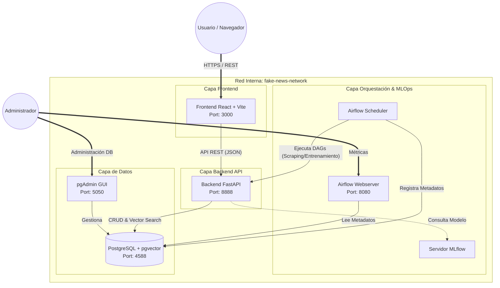
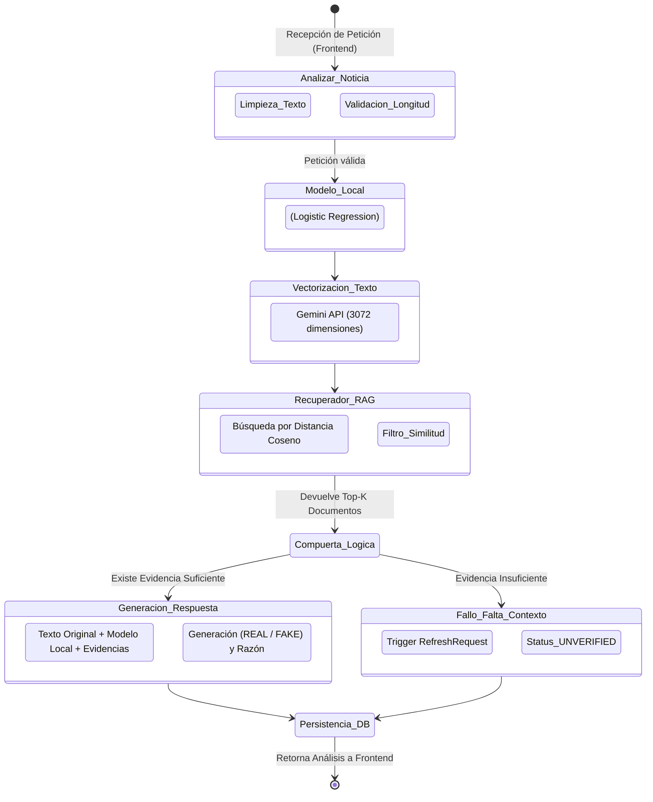
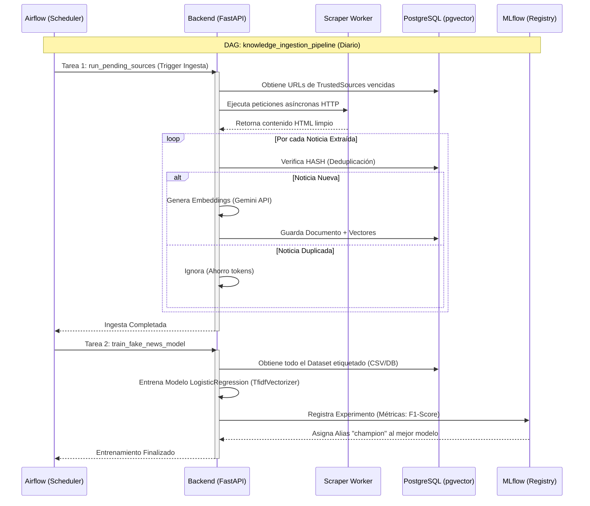
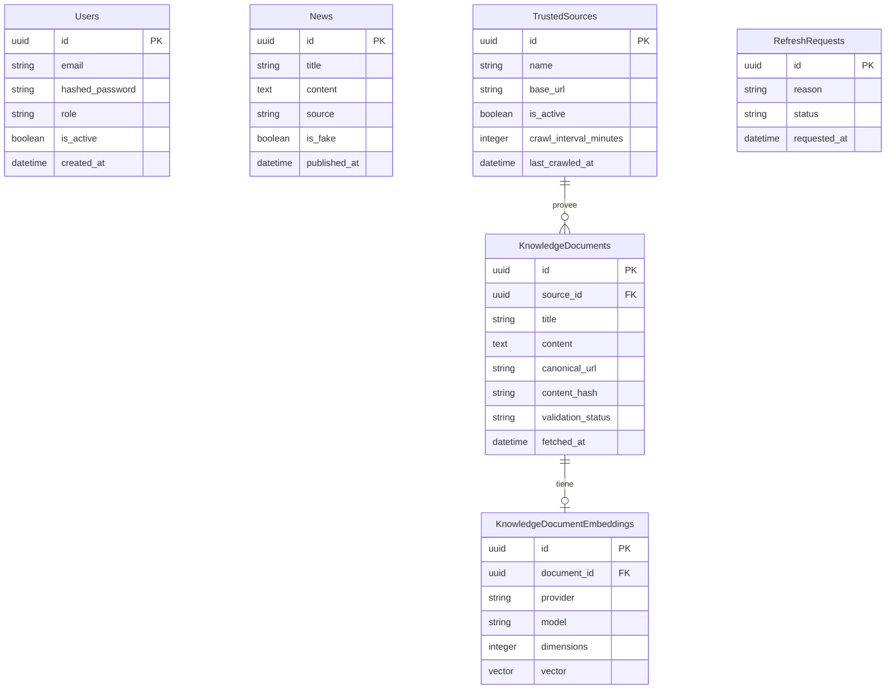

# TIKO: Sistema Inteligente RAG para la Detección y Verificación de Noticias Falsas

**Documento de Presentación - Proyecto de Maestría**

Este documento detalla la fundamentación, objetivos y arquitectura de "TIKO", un sistema integral diseñado para combatir la desinformación utilizando modelos de Machine Learning tradicionales combinados con flujos de trabajo avanzados de Inteligencia Artificial Generativa y Arquitectura RAG (Retrieval-Augmented Generation).

---

## 📖 1. Fundamentación del Proyecto

### Justificación
En la era digital contemporánea, la rápida propagación de noticias falsas (fake news) a través de redes sociales y plataformas digitales representa una amenaza significativa para la estabilidad social, la democracia y el derecho a la información veraz. Las metodologías tradicionales de verificación (fact-checking) manual son insuficientes ante el volumen y la velocidad con la que se genera la desinformación. 

Frente a esta problemática, se justifica el desarrollo de **TIKO**, un sistema automatizado que no solo clasifica estadísticamente un texto, sino que además implementa un razonamiento analítico al recuperar evidencia en tiempo real de fuentes confiables (Arquitectura RAG). Esto mitiga el problema de las "alucinaciones" inherente a los Modelos de Lenguaje Grande (LLMs) y provee al usuario final una explicación justificada, transparente y trazable sobre por qué una noticia es catalogada como falsa o verdadera.

---

## 🎯 2. Objetivos del Proyecto

### Objetivo General
Desarrollar e implementar un sistema inteligente integral basado en Arquitectura RAG (Retrieval-Augmented Generation) y Agentes Inteligentes para la detección, análisis y verificación automatizada de noticias falsas en tiempo real, garantizando alta precisión y trazabilidad de las fuentes de información.

### Objetivos Específicos
1. **Diseñar e implementar un motor de Ingesta Continua:** Desarrollar un sistema de web scraping orquestado que automatice la extracción, limpieza, deduplicación y almacenamiento de artículos provenientes de fuentes confiables predefinidas.
2. **Desarrollar un flujo MLOps para Modelos Locales:** Entrenar y versionar de manera continua un modelo de Aprendizaje Supervisado (Regresión Logística) que proporcione una clasificación base ultrarrápida y de bajo costo computacional, gestionado mediante MLflow y Apache Airflow.
3. **Construir el Agente de Verificación RAG:** Implementar un grafo de estados (utilizando LangGraph) que orqueste consultas a una base de datos vectorial (PostgreSQL + pgvector), recupere contexto semántico y delegue la decisión final a un Modelo de Lenguaje Grande (Google Gemini) para generar justificaciones interpretables.
4. **Diseñar una Interfaz de Usuario (UI/UX) Moderna:** Construir un panel web reactivo bajo los principios de *Glassmorphism* y *Green Tech* que permita a los usuarios ingresar afirmaciones, visualizar el análisis de veracidad (confianza y razonamiento) y administrar las fuentes y estadísticas del sistema.
5. **Desplegar la Arquitectura en Contenedores:** Modularizar el sistema completo (Frontend, Backend, Base de Datos, MLflow, Airflow) utilizando Docker para asegurar un despliegue repetible, escalable y tolerante a fallos.

---

## 🏗️ 3. Arquitectura Global y Tecnologías

El proyecto adopta una arquitectura modular de microservicios orientada al dominio (DDD), separando las responsabilidades de presentación, orquestación, lógica de negocio y persistencia de datos.

### Stack Tecnológico
*   **Frontend Web:** React 19, TypeScript, Tailwind CSS v4 (Glassmorphism UI), Zustand.
*   **Backend API:** FastAPI (Python 3.12), Pydantic, SQLAlchemy.
*   **Bases de Datos:** PostgreSQL 16 con extensión `pgvector` para el almacenamiento de embeddings semánticos.
*   **Inteligencia Artificial:** LangGraph (Agentes), API de Google Gemini (Generación y Embeddings), scikit-learn (Logistic Regression).
*   **MLOps y Orquestación:** Apache Airflow, MLflow local.
*   **Contenedorización:** Docker & Docker Compose.

---

## 🗺️ 4. Diagramas de Despliegue (Deployment)

El ecosistema corre de forma modularizada y contenerizada. Se utilizan redes internas para aislar las bases de datos de la red pública.

### Diagrama de Despliegue (Infraestructura Global)

> [!NOTE]  
> Para prevenir colisiones de metadatos, Airflow utiliza su propia base de datos lógica `airflow_db` dentro de PostgreSQL, mientras que FastAPI y LangGraph utilizan `fake_news_db`.

---

## ⚙️ 5. Diagrama de Lógica RAG y Procesos Backend

El núcleo de verificación no depende únicamente de la estadística, sino de un flujo de **Agente Inteligente Orquestado** (StateGraph) que evalúa dinámicamente si se posee la evidencia necesaria para emitir un juicio.

### Flujo Interno del Agente (LangGraph Pipeline)

---

## 📊 6. Flujo de Operaciones Machine Learning (MLOps) e Ingesta

El sistema integra Apache Airflow para garantizar que la base de datos de conocimiento RAG y el modelo predictivo base estén siempre actualizados mediante ciclos automatizados de Web Scraping y re-entrenamiento.

### Arquitectura MLOps y DAGs

### Explicación del Modelo
- **Pre-procesamiento:** `TfidfVectorizer` (Term Frequency-Inverse Document Frequency) con hasta 10,000 features.
- **Clasificador:** `LogisticRegression` con `class_weight='balanced'` para contrarrestar desbalances en el set de datos.
- **Métrica Principal:** F1-Score ponderado para balancear el impacto entre falsos positivos y falsos negativos.

---

## 🗃️ 7. Dataset y Consistencia de la Información

La robustez del modelo estadístico y del sistema RAG recae en la calidad y consistencia del dataset utilizado (`bolivia_fakenews_dataset.csv`).

### Origen y Características del Dataset
- **Fuente de Datos:** El dataset ha sido curado recolectando afirmaciones verificadas por agencias de fact-checking regionales y noticias extraídas de portales gubernamentales o medios de prensa confiables.
- **Estructura:** Cada registro cuenta con el texto completo del reclamo, la fuente de procedencia, fecha y la etiqueta de veracidad (`0 = FAKE`, `1 = REAL`).
- **Balance de Clases:** El dataset incluye una proporción representativa tanto de noticias verdaderas como falsas para garantizar que el modelo no genere sesgos hacia una clase mayoritaria.

### Consistencia y Mantenimiento
Para asegurar que el sistema no se degrade frente a las nuevas narrativas de desinformación, TIKO aplica las siguientes reglas de consistencia de información:
1. **Deduplicación por Hashing Constante:** Al realizar Web Scraping, se genera un Hash `SHA-256` sobre el texto puro. Esto garantiza que la Base de Datos Vectorial (PostgreSQL + pgvector) jamás guarde el mismo artículo o evidencia dos veces, evitando sesgar al LLM con información redundante.
2. **Ciclos de Refresco Semántico:** Si el sistema de LangGraph no encuentra similitud coseno en los documentos existentes para verificar una noticia (Estado `UNVERIFIED`), automáticamente reporta la falta de conocimiento. Airflow se encarga de re-alimentar la base y re-entrenar el modelo, asegurando que el conocimiento del sistema (Dataset) esté siempre actualizado.
3. **Limpieza Automatizada de Textos:** Antes de que cualquier noticia ingrese al dataset o a los embeddings, un pipeline de limpieza elimina etiquetas HTML ocultas, scripts, menús y metadatos irrelevantes usando BeautifulSoup, preservando la pureza semántica de los textos.

---

## 🔐 8. Estructura de Base de Datos Relacional

Se presenta el Diagrama Entidad-Relación que soporta la persistencia transaccional y vectorial.

