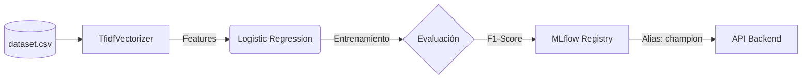
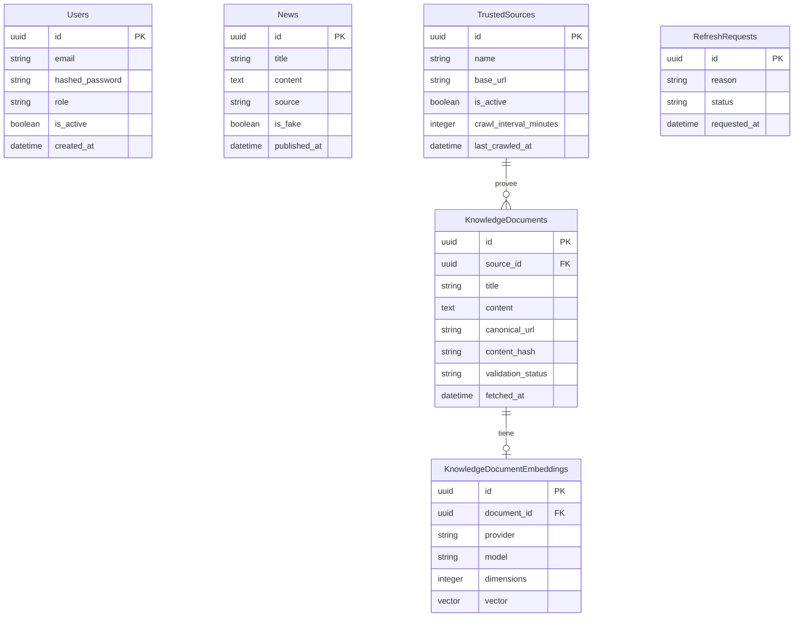
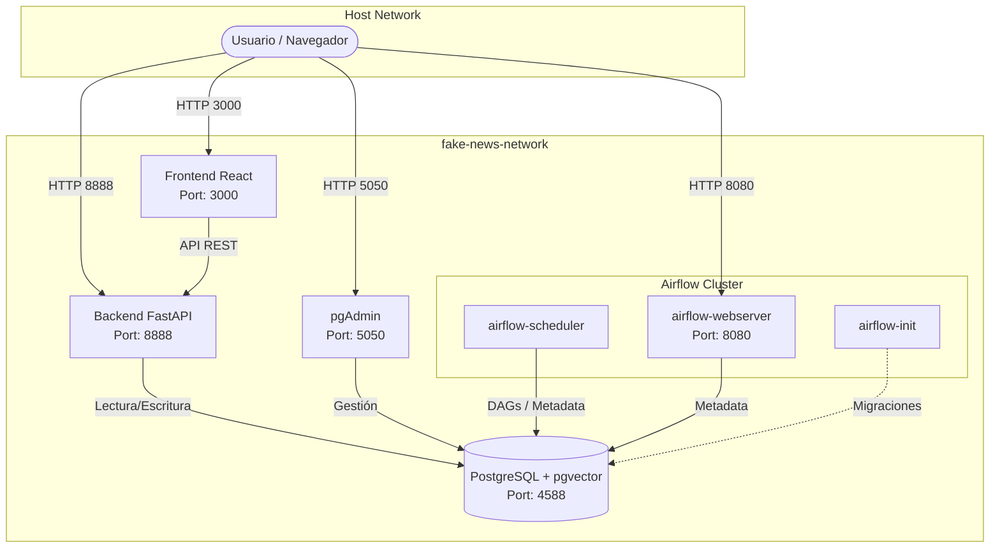

# FakeNewsRAGSystem

Sistema completo para la detección y verificación de noticias falsas mediante Inteligencia Artificial. Este sistema va más allá de la clasificación tradicional, integrando una arquitectura RAG (Retrieval-Augmented Generation) para recuperar evidencia contextual, bases de datos vectoriales para búsquedas semánticas, y un pipeline completo de orquestación y machine learning.

---

## 💻 Arquitectura Tecnológica y Stack

El proyecto adopta una arquitectura modular de microservicios orientada al dominio (DDD), separando responsabilidades clave.

### 1. Frontend (Capa de Presentación Web)

El panel administrativo y portal de verificación está construido para la máxima reactividad y diseño visual.

- **Framework Core:** **React 19** y **TypeScript**, empaquetados con **Vite** para HMR ultra-rápido.
- **Gestión de Estado:** **Zustand** para manejar la sesión del usuario y variables globales de forma ligera.
- **Estilización:** **Tailwind CSS v4** integrado con tokens de diseño Premium (basado en exportaciones de herramientas como Stitch), incluyendo variables de modo oscuro (`dark mode`) y variables CSS en el `index.css`.
- **Rutas:** React Router para navegación SPA (Single Page Application) protegida.
- **Iconografía:** Lucide Icons.

### 2. Backend (Capa de API y Lógica de Negocio)

El núcleo transaccional sigue una estructura inspirada en DDD (Domain-Driven Design).

- **Framework Core:** **FastAPI** (Python 3.12) para endpoints asíncronos rápidos y autogeneración de OpenAPI (Swagger).
- **Estructura de Carpetas:**
  - `app/domain`: Entidades puras y contratos.
  - `app/application`: Casos de uso (ej. `NewsService`, `AuthService`).
  - `app/infrastructure`: Implementaciones técnicas (SQLAlchemy, `pgvector`, Conexión Gemini API, Agentes de LangGraph).
  - `app/presentation`: Endpoints (`routers`) expuestos.
- **Seguridad:** Autenticación por **JWT** (JSON Web Tokens) con dependencias protegidas y contraseñas hasheadas.

### 3. MLOps (Operaciones de Machine Learning)

Para garantizar la mejora continua y el versionado seguro del modelo, se implementa una suite de MLOps:

- **Pipeline Automatizado:** Airflow llama al script `train_classifier.py` periódicamente.
- **Versionado de Experimentos:** Todo el entrenamiento está traceado por **MLflow** local. Guarda métricas como el `F1-Score`, hiperparámetros del `TfidfVectorizer` y el propio archivo binario del modelo.
- **Registro del Modelo (Registry):** Los modelos exitosos se etiquetan con el alias `champion` (campeón) y las APIs del backend de clasificación local leen de esta etiqueta en caliente sin necesidad de reiniciar la API.

---

## 🧠 Entrenamiento del Modelo de Machine Learning

Para la clasificación automática (predicción base), el sistema implementa un modelo de **Aprendizaje Supervisado** entrenado con el dataset `dataset/bolivia_fakenews_dataset.csv`.

### Algoritmo Utilizado

El algoritmo principal seleccionado es **Regresión Logística (Logistic Regression)**.

- **Pre-procesamiento:** Se emplea `TfidfVectorizer` (Term Frequency-Inverse Document Frequency) con hasta 10,000 _features_ para convertir el texto plano en vectores de características numéricas.
- **Clasificador:** Se configura la `LogisticRegression` con pesos balanceados (`class_weight='balanced'`) para prevenir sesgos en caso de que el dataset original tenga un desbalance entre noticias FAKE y REAL.
- **Métrica Principal:** Dado que se busca equilibrar el impacto tanto de falsos positivos como de falsos negativos, se utiliza **F1-Score (weighted)** como métrica de evaluación prioritaria.

### Integración y Pipeline con MLflow

El entrenamiento y versionado se realiza con **MLflow**, siguiendo este pipeline automatizado:

1. Un DAG de Airflow (`train_fake_news_model`) ejecuta el script `backend/scripts/train_classifier.py`.
2. El script lee el CSV, entrena el pipeline y evalúa el F1-Score.
3. Se registra el modelo, parámetros e hiperparámetros en el servidor de MLflow, etiquetando el modelo bajo el alias `champion`.

---

## 🗄️ Arquitectura de Base de Datos

### Diagrama Entidad-Relación (ER)

### Base de Datos Vectorial (pgvector)

El sistema utiliza la extensión **`pgvector`** de PostgreSQL.
A diferencia de las bases de datos tradicionales que solo hacen coincidencias por palabras clave (keyword search), `pgvector` permite almacenar los **embeddings** (vectores numéricos de 3072 dimensiones generados por Gemini Embeddings) de cada noticia y documento.
Cuando se consulta la veracidad de una noticia, el sistema:

1. Convierte la consulta a un vector.
2. Ejecuta una búsqueda por "Distancia Coseno" o "Producto Punto" dentro de Postgres.
3. Devuelve los N documentos con mayor similitud semántica.
   Esto permite que el sistema detecte "fake news" que usan palabras distintas pero mantienen el mismo significado o contexto engañoso.

---

## 🏗️ Diagrama de Despliegue (Docker)

El ecosistema corre de forma modularizada y contenerizada mediante `docker-compose`.

> [!NOTE]
> Para evitar conflictos de migraciones de `alembic` (dado que FastAPI y Airflow usan SQLAlchemy), Airflow guarda su metadata en una base de datos propia `airflow_db` dentro del mismo contenedor de PostgreSQL, mientras que el Backend utiliza `fake_news_db`.

---

## 🕷️ Ingesta de Datos y Web Scraping

El sistema no requiere alimentar noticias de manera manual una por una. Integra un motor de extracción (Web Scraping) controlado.

### ¿Cómo se alimenta?

1. **Fuentes Confiables (TrustedSources):** El sistema mantiene un listado de URLs verificadas configurables por los administradores.
2. **Scraping con HTTpx + HTML Extractor:** Un proceso en el worker realiza peticiones asíncronas (`httpx.get`) a las URLs. Utilizando utilidades BeautifulSoup se limpia el HTML, eliminando menús y scripts para extraer la noticia real y el título.
3. **Deduplicación por Hash:** Para cada noticia extraída, se genera un hash `SHA-256` del contenido textual puro (`content_hash`). Si el hash ya existe en la base de datos (o la misma `canonical_url`), el sistema ignora la ingesta de ese documento, ahorrando tokens de API y evitando redundancias en la base vectorial.
4. **Vectorización:** Si el texto es nuevo, se envía al API de Google (Gemini Embedding) para generar su vector y se almacena en PostgreSQL con estado `ingested`.

---

## ⏱️ Orquestación con Apache Airflow

Para mantener el sistema actualizado, todo el pipeline de ingesta y aprendizaje continuo está orquestado mediante **Apache Airflow**.

### Explicación al detalle de DAGs

El DAG principal `knowledge_ingestion_pipeline` tiene el objetivo de ingerir nuevo conocimiento en la DB y posteriormente re-entrenar el modelo con los nuevos datasets verificados.

- **Frecuencia (Schedule):** Está configurado para correr con `timedelta(days=1)` (Una vez al día).
- **Tarea 1: `run_pending_sources` (PythonOperator)**
  Realiza una petición al endpoint del backend `/knowledge/ingest`. Esto fuerza al Backend a buscar cuáles `TrustedSources` han vencido su `crawl_interval_minutes` y realizar el ciclo de Web Scraping mencionado en la sección anterior. También actualiza el estatus de las peticiones (`RefreshRequests`) a `processed` para informar al sistema que el vacío de conocimiento fue resuelto.
- **Tarea 2: `train_fake_news_model` (BashOperator)**
  Tras finalizar la recolección, esta tarea ejecuta directamente el script de entrenamiento de Machine Learning en Python (`train_classifier.py`), asegurando que siempre se evalúen y logueen las últimas versiones del dataset contra el modelo Logístico en MLflow.
- **Dependencias:** Ambas tareas corren de forma secuencial `ingest_knowledge >> train_model`.

---

## 🤖 El Sistema como Agente Inteligente (LangGraph + RAG)

El corazón de FakeNewsRAGSystem no es solo un modelo de clasificación estático, sino un **Agente Inteligente Orquestado** basado en grafos de estado utilizando la librería **LangGraph**. Esto le otorga al sistema capacidades de razonamiento, toma de decisiones condicional y contexto extendido.

### Flujo del Agente (StateGraph)

Cada vez que se solicita el análisis de una noticia, la petición entra en un flujo de nodos (agentes especializados) que comparten un estado global (`NewsRAGState`):

1. **Agente de Preparación (`analyze_news`):** Limpia el texto de entrada y prepara el estado.
2. **Clasificador Local (`local_model`):** Ejecuta el modelo supervisado (Regresión Logística entrenado con MLflow) para obtener un _baseline_ de probabilidad local de que la noticia sea falsa, de forma ultra-rápida y a bajo coste computacional.
3. **Agente de Embedding (`embedding`):** Si la noticia requiere más contexto, este nodo se conecta a la API de **Gemini** para vectorizar la semántica del texto en 3072 dimensiones.
4. **Agente Recuperador (`retriever`):** Realiza una búsqueda vectorial en la base de datos `pgvector` para encontrar documentos históricos, artículos o evidencias (provenientes de TrustedSources) relacionados semánticamente.
5. **Agente Compuerta Lógica (`evidence_gate`):** Un nodo de control que evalúa si la evidencia recuperada es lo suficientemente sólida o si el caso amerita una generación de respuesta avanzada.
   - _Ruta A:_ Si no hay evidencia, aborta el uso de LLM para ahorrar costos y devuelve un fallo por falta de contexto (`UNVERIFIED`), encolando un trabajo de Airflow.
   - _Ruta B:_ Si hay evidencia, dirige el grafo hacia el agente de análisis generativo.
6. **Agente de Análisis Generativo (`analysis`):** Utiliza un **LLM de Gemini** pasándole como prompt el reclamo original del usuario, el veredicto del modelo local, y toda la evidencia real extraída de la base vectorial. El LLM actúa como juez, emitiendo un veredicto estructurado (Razón, Confianza, Etiqueta) y citando las fuentes utilizadas.
7. **Persistencia (`storage`):** Finalmente, guarda los resultados, métricas de confianza y los vectores generados para que las próximas interacciones del agente sean aún más rápidas.

Esta arquitectura de agentes multi-etapa garantiza que el sistema no sufra de "alucinaciones" (pues el LLM está limitado estrictamente a la evidencia recuperada por el retriever) y permite delegar tareas repetitivas al modelo local (Regresión Logística) mientras se reserva el razonamiento profundo para el LLM.

---

## 💡 Ejemplos de Uso (Flujo Real al Detalle)

### 1. El Análisis RAG (Usuario)

El usuario entra a la interfaz Frontend (Dashboard) e ingresa una premisa dudosa en el "Analizador de Noticias": _"El gobierno aprueba nueva ley de impuestos al oxígeno"_.

- **Paso 1:** El Frontend envía el claim a la API `POST /rag/analyze`.
- **Paso 2:** El Backend vectoriza la frase del usuario.
- **Paso 3:** Realiza un vector search contra la tabla `KnowledgeDocumentEmbeddings` (pgvector).
- **Paso 4:** Se recuperan las top-3 noticias similares del índice de conocimiento (Evidencia).
- **Paso 5:** El LLM Generativo (Gemini) recibe el texto original + la evidencia, procesando un prompt que le pide dictaminar una decisión final (`REAL`, `FAKE`, `UNVERIFIED`).
- **Paso 6:** El Frontend recibe la evaluación y pinta un Panel Circular de Confianza (p.ej. 85%) mostrando la razón detallada y links a los artículos originales encontrados en el proceso.
- **Paso 7 (Fallo):** Si el LLM dictamina `UNVERIFIED` porque las evidencias no servían, el Backend crea un ticket automático en la tabla `RefreshRequests` marcando que se necesita nueva información sobre ese tema.

### 2. Panel de Administrador y Re-Entrenamiento

Los administradores pueden revisar desde su UI el estado del conocimiento (noticias procesadas, documentos vectorizados).
Si detectan muchos "UNVERIFIED" (peticiones de refresco pendientes), el administrador abre **Airflow (`localhost:8080`)** y presiona **"Trigger DAG"** en `knowledge_ingestion_pipeline`.
En cuestión de minutos:

1. El sistema raspa los portales de noticias confiables dados de alta.
2. Deduplica, y vectoriza los artículos de hoy.
3. Se re-entrena el modelo base local de Machine Learning y MLflow genera la nueva versión de predicción de texto.
4. Las estadísticas del Frontend se actualizan para mostrar que los tickets pendientes (`Pending Refreshes`) vuelven a estar en 0. lista para extensión en automatización, observabilidad y despliegue en producción.
